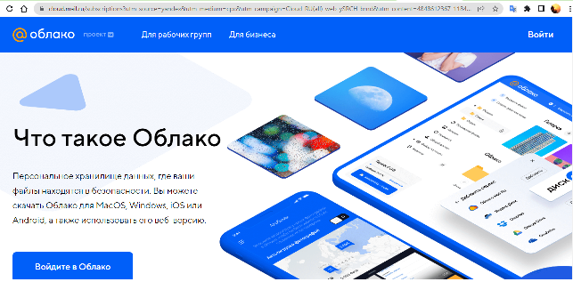
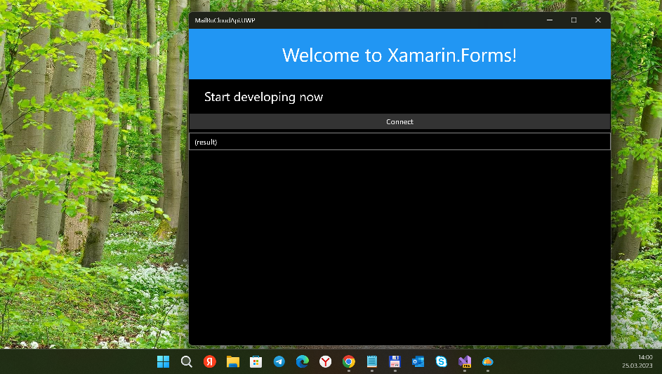

# MailRuCloudX  / "MailRuCloud мульти-клиент"

MailRuCloud (cloud.mail.ru) simple Xamarin Forms sample app (template). Штука для взаимодействия с MailRu Cloud через API. 
Была сделана по причине устаревания стандартного приложения Облако МайлРу для винфонов (оно тупо не даёт залогиниться 
и войти, а значит и работать с файло/папками).

RU only. Только для России.

## Screenshots

## Current Status
- New version (or "iteration") with minimal improvements ("null value & exceptions" bug detected & fixed)
- Ready Targets: UWP, W10 or 11 (min. os. build 16299 at now)
- Not ready/not tested Targets/Platforms: iOS and Android

## TODO
- Add .net 1.4 lib for "15063" compatibility.
- Add some UI

## .

AS IS. Как есть.

[m][e] 2022-2023

